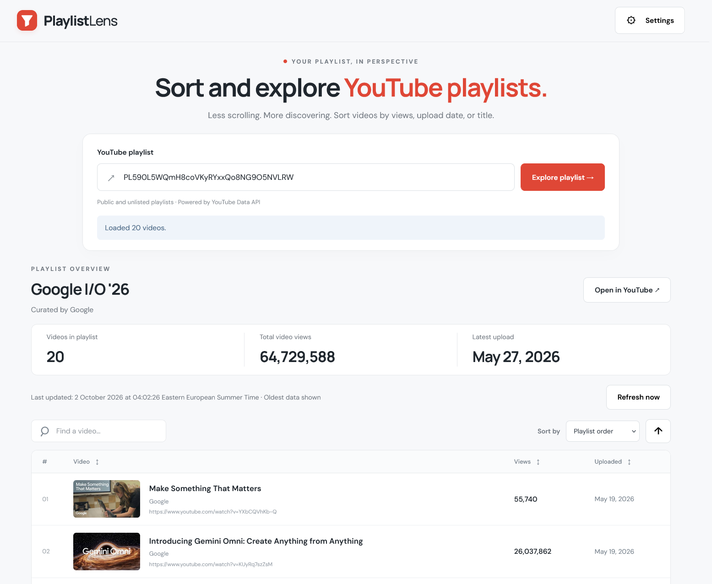

# Playlist Lens

A responsive, single-page YouTube playlist explorer for GitHub Pages. Plain HTML, CSS, and JavaScript; no runtime dependencies or backend.



## Production site

Visit **[playlist-lens.dev](https://playlist-lens.dev/)**, hosted on GitHub Pages with a custom domain.

## Run locally

Requires Node.js 22 or later. No package installation is needed.

```sh
npm run dev
```

Open http://127.0.0.1:5173. To load real playlists locally, set `youtubeApiKey` in `config.js` using a key that allows your local origin.

## Create a YouTube API key

1. In [Google Cloud Console](https://console.cloud.google.com/), select or create a project. A separate Google account is unnecessary; a dedicated project for this app is recommended.
2. Enable **YouTube Data API v3** under **APIs & Services → Library**.
3. Open **APIs & Services → Credentials → Create credentials → API key**. If the credential wizard asks which data you will access, select **Public data**. This app reads public and accessible unlisted playlists; **User data** requires OAuth and is not needed here.
4. Edit the key. Under **API restrictions**, select **Restrict key → YouTube Data API v3**.
5. Under **Application restrictions**, select **Websites (HTTP referrers)** and add the addresses where your app runs:
   - Production: `https://playlist-lens.dev` and `https://playlist-lens.dev/*`.
   - GitHub Pages address, if used: `https://ib38.github.io` and `https://ib38.github.io/*` (replace the username for your own deployment).
   - Local development: `http://127.0.0.1:5173` and `http://127.0.0.1:5173/*`, preferably on a separate development key.
6. Save the restrictions. Use a domain-wide pattern, not a repository path such as `/yt-playlist-viewer/`: requests to Google may send only the site's origin.

The key is embedded in the webpage and visible to visitors, even if supplied through a GitHub secret. Use a standard API key, not a service-account-bound authorization key. It does not grant your Google account or project administrator permissions; misuse can consume the project's shared API quota. Restrict the key and monitor usage.

References: [YouTube credentials](https://developers.google.com/youtube/registering_an_application), [key restrictions](https://docs.cloud.google.com/api-keys/docs/add-restrictions-api-keys).

## Deploy to GitHub Pages

1. Push the project, including `.github/workflows/pages.yml`, to a repository with a `main` or `master` branch.
2. Open **Settings → Secrets and variables → Actions → Variables → New repository variable**. Set the name to `YOUTUBE_API_KEY` and the value to your restricted API key. Use a **repository variable**, not an environment variable or secret. Deployment fails if it is missing or blank.
3. In **Settings → Pages → Build and deployment → Source**, select **GitHub Actions**. **Deploy from a branch** does not inject the repository variable into the site.
4. Open the repository's **Actions** tab, select **Deploy to GitHub Pages**, and choose **Run workflow**. This is our custom workflow's name, not a suggested template; skip the Jekyll template. Future pushes to `main` or `master` deploy automatically.
5. After a successful run, **Settings → Pages** shows the published URL and links to the latest deployment. Suggested templates may still appear; they do not mean setup is incomplete.

The workflow tests the app, builds `dist/` with the API key, and publishes it. If you use a custom domain, configure it in Pages settings and include that domain in the key's website restrictions.

## Checks and build

```sh
npm test
npm run build
```

The build writes static files to `dist/`. A `YOUTUBE_API_KEY` environment variable overrides `config.js` in the build output only.

For browser storage checks, run the local server and open `/test/storage-browser.html`. It uses an isolated temporary database and is excluded from the production build.
